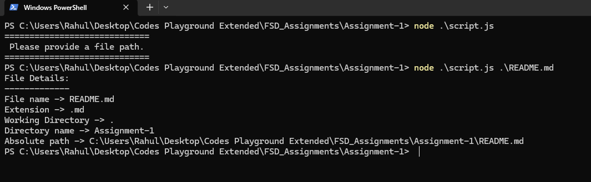

# Assignment-1 : Node.js Path Module 

 ## 📌 Question

 Using the Node.js `path` module, create a program that receives a file path and displays:

- File name
- File extension
- Directory name
- Absolute path

 Also explain why using `path.join()` is generally safer than manually concatenating paths using `/`.

---

 ## 💻 Solution

```javascript
import path from "path"

function fileProps(usrFilePath) {           // Our main Function displaying properties of File
    console.log('File Details: ')
    console.log('-------------')
    console.log(`File name -> ${path.basename(usrFilePath)}`)
    console.log(`Extension -> ${path.extname(usrFilePath)}`)
    console.log(`Working Directory -> ${path.dirname(usrFilePath)}`)
    console.log(`Directory name -> ${path.basename(path.dirname(path.resolve(usrFilePath)))}`)
    console.log(`Absolute path -> ${path.resolve(usrFilePath)}`)
}

const filePath = process.argv[2]           // Takes Filename as the Second argument of program running

if (filePath) {                            // If Filename is given, shows its Properties
    fileProps(filePath)
} else {                                   // If filePath is not given, shows a Message
    console.log('=============================')
    console.log(' Please provide a file path. ')
    console.log('=============================')
}
```

---

 ## ▶️ How to Run

 Provide the file path as a command-line argument:

```js
node script.js <FilePathName>
```

 ### Example Output



<details>
<summary>📄 Output in Text</summary>

```text
File Details:
-------------
File name -> example.txt
Extension -> .txt
Working Directory -> ./folder
Directory name -> folder
Absolute path -> /path/to/current/directory/folder/example.txt
```
</details>


---

 ## 🔍 Functions Used

 | Function | Description |
| --- | --- |
| `path.basename()` | Returns the last part of a path, such as the file name |
| `path.extname()` | Returns the file extension |
| `path.dirname()` | Returns the directory portion of a path |
| `path.resolve()` | Converts a path into an absolute path |

---

 ## 🛡️ Why is `path.join()` Safer?

 `path.join()` is safer than manually concatenating paths using `/` because it automatically uses the **correct path separator for the operating system**.

 For example:

```js
const fullPath = path.join(
    'folder',
    'subfolder',
    '..',
    'file.txt'
)

console.log(fullPath)
```

 `path.join()` also **normalises `..` and duplicate slashes**, making paths more reliable and easier to work with.

 For example:

```bash
folder/subfolder/../file.txt
```

 is normalised to:

```bash
folder/file.txt
```

 It also handles platform-specific separators:

```bash
Linux/macOS → folder/file.txt
Windows     → folder\file.txt
```

 Therefore, `path.join()` makes path handling **cross-platform, cleaner, and less error-prone**.

---

 > [](https://github.com/KhatarnakSamarth)